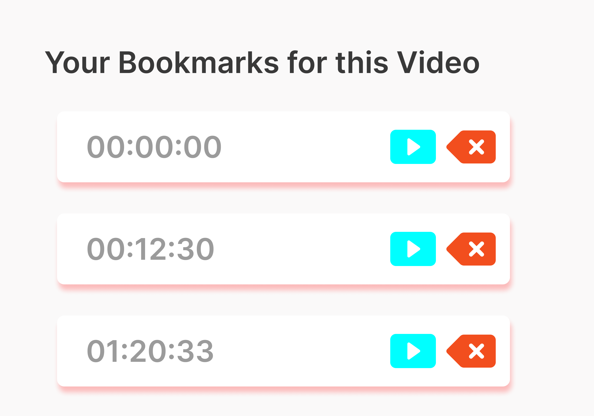

<h1 align="center">  <b> Youtube Timeline Bookmarker </b></h1>
<!-- PROJECT LOGO -->

<h2><b>📚 Bookmark timelines in Youtube videos</b></h2>

  

  
---

  

  
  

  
  # [DEMO LINK](https://yttb.netlify.app/)

<table>
  <tr>
    <td></td>
    <td></td>
  </tr>
  
</table>

---

## Tech Stack 💻

---

 

